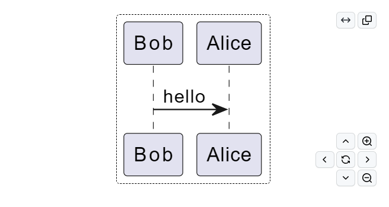
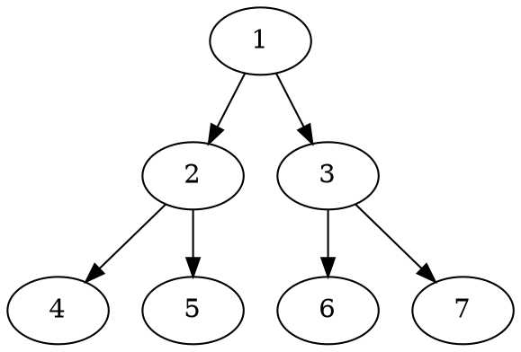
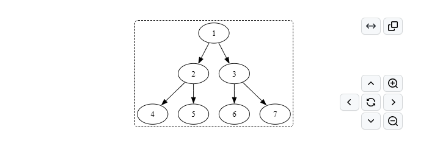
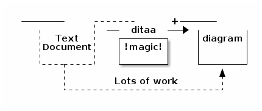
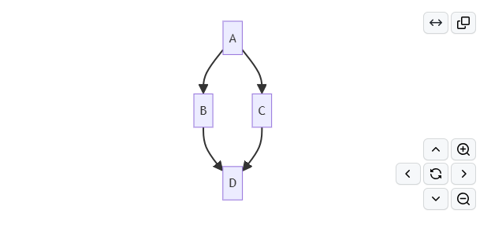

# markdown-it-diagram

[![npm version][npm-version-src]][npm-version-href]
[![npm downloads][npm-downloads-src]][npm-downloads-href]
[![bundle][bundle-src]][bundle-href]
[![JSDocs][jsdocs-src]][jsdocs-href]
[![License][license-src]][license-href]

markdown-it-diagram is a markdown-it plugin for diagram. It supports mermaid, plantuml. It supports contorls like zoom, move.

## UML examples
Markdown fence identifier：[plantuml](https://plantuml.com/)、[mermaid](https://github.com/mermaid-js/mermaid)、[dot](https://graphviz.gitlab.io/doc/info/lang.html)、[ditaa](https://ditaa.sourceforge.net/)

### PlantUML

[online](https://www.plantuml.com/plantuml/uml/)

````markdown
```plantuml
Bob -> Alice : hello
```
````


### DOT

````markdown

````


### ditaa
> [!WARNING]
> On PlantUML, only PNG generation is supported.
````
```ditaa
+--------+   +-------+    +-------+
    |        | --+ ditaa +--> |       |
    |  Text  |   +-------+    |diagram|
    |Document|   |!magic!|    |       |
    |     {d}|   |       |    |       |
    +---+----+   +-------+    +-------+
        :                         ^
        |       Lots of work      |
        +-------------------------+
```
````


### mermaid

````markdown

````


## Install
```bash
npm install markdown-it-diagram --save
```
## Usage
vite.config.ts
```ts
import MarkdownItDiagrams from 'markdown-it-diagram'
import Markdown from 'unplugin-vue-markdown/vite'
export default defineConfig({
  plugins: [
    Markdown({
      markdownItSetup(md) {
        md.use(MarkdownItDiagrams, {
          showController: true, // show controller,default:false
          /**
           * PlantUML options
           * ditaa:imageFormat 'png| txt'
           * plantuml: imageFormat'png| svg| txt'
           * dot: imageFormat'png| svg| txt'
           */
          // imageFormat: 'svg', // image format:svg|png|txt,default:svg
          // server: '', // plantuml server,default:http://www.plantuml.com/plantuml
          // ditaa: {
          // imageFormat: 'svg', // image format:png|txt,default:svg
          // server: '', // plantuml server,default:http://www.plantuml.com/plantuml
          // }
        })
      }
    })
  ]
})
```
If you open the controller, you need to import the script in the initialization.
vue3 example:
```vue
<script setup lang="ts">
import { markdownItDiagramDom } from 'markdown-it-diagram/dom'
import { onMounted } from 'vue'
onMounted(async () => {
  // if you want to use mermaid, you need to install mermaid.js
  // npm install mermaid
  // import mermaid from 'mermaid'
  mermaid.initialize({ startOnLoad: false })
  await mermaid.run()
  // initialize markdown-it-diagram/dom script
  await markdownItDiagramDom()
})
</script>
```
## References

- [markdown-it-textual-uml](https://github.com/manastalukdar/markdown-it-textual-uml)
- [markdown-it](https://github.com/markdown-it/markdown-it)

## License

[MIT](./LICENSE) License © 2023-PRESENT [RyanCo](https://github.com/rr210)

<!-- Badges -->

[npm-version-src]: https://img.shields.io/npm/v/markdown-it-diagram?style=flat&colorA=080f12&colorB=1fa669
[npm-version-href]: https://npmjs.com/package/markdown-it-diagram
[npm-downloads-src]: https://img.shields.io/npm/dm/markdown-it-diagram?style=flat&colorA=080f12&colorB=1fa669
[npm-downloads-href]: https://npmjs.com/package/markdown-it-diagram
[bundle-src]: https://img.shields.io/bundlephobia/minzip/markdown-it-diagram?style=flat&colorA=080f12&colorB=1fa669&label=minzip
[bundle-href]: https://bundlephobia.com/result?p=markdown-it-diagram
[license-src]: https://img.shields.io/github/license/rr210/markdown-it-diagram.svg?style=flat&colorA=080f12&colorB=1fa669
[license-href]: https://github.com/rr210/markdown-it-diagram/blob/main/LICENSE
[jsdocs-src]: https://img.shields.io/badge/jsdocs-reference-080f12?style=flat&colorA=080f12&colorB=1fa669
[jsdocs-href]: https://www.jsdocs.io/package/markdown-it-diagram
